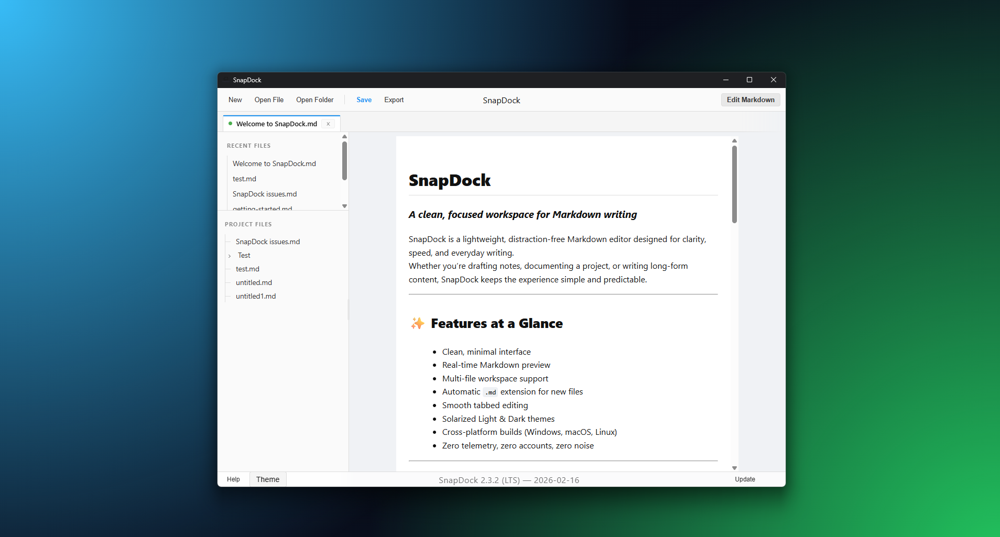
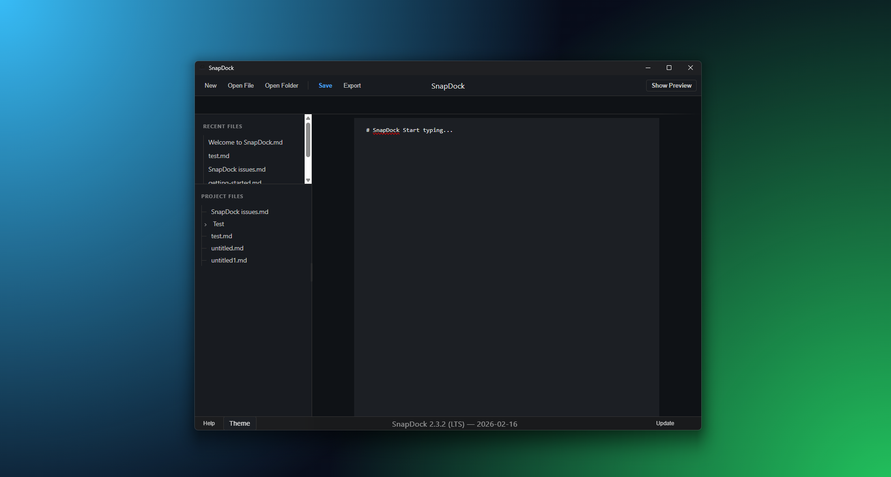
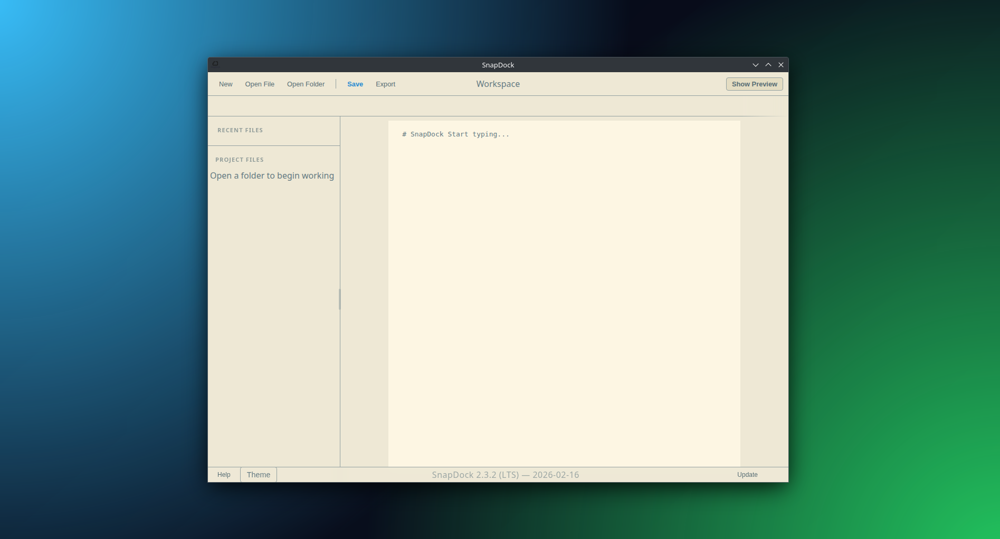
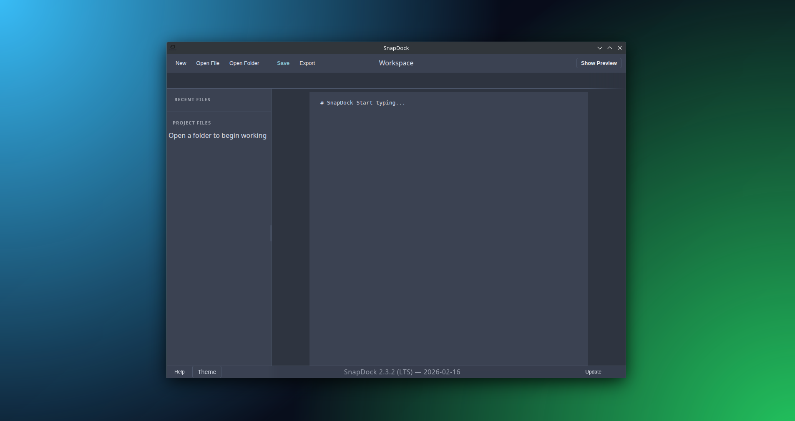

<table align="center" style="border-collapse:collapse;">
  <tr>
    <td style="padding:6px;">
      <a href="https://snapdock.app">
        
      </a>
    </td>
    <td style="padding:6px;">
      <a href="https://github.com/ZFordDev/SnapDock/issues">
        
      </a>
    </td>
    <td style="padding:6px;">
      <a href="https://github.com/ZFordDev/SnapDock/blob/main/CONTRIBUTING.md">
        
      </a>
    </td>
    <td style="padding:6px;">
      <a href="https://docs.snapdock.app">
        
      </a>
    </td>
    <td style="padding:6px;">
      <a href="https://staxdash.com">
        
      </a>
    </td>
    <td style="padding:6px;">
      <a href="https://ko-fi.com/zforddev">
        
      </a>
    </td>
    <td style="padding:6px;">
      <a href="https://zforddev.itch.io/snapdock">
        
      </a>
    </td>
  </tr>
</table>


<p align="center">
  
</p>

<p align="center">
   <strong>Clean, stable, long‑term Markdown editing</strong><br/>
   Built by <strong>ZFordDev</strong>
</p>

---

## **Overview**

SnapDock is a lightweight Markdown editor built with Electron and powered by **markdown‑it**.  
It delivers a clean, modern writing experience with a layout inspired by professional editors — but without the bloat.

SnapDock feels closer to a traditional writing app than a developer tool.  
It’s designed for clarity, stability, and long‑term reliability, making it ideal for notes, documents, and everyday writing.

---

## 🛡️ **Long‑Term Support (LTS)**

SnapDock is a **Long‑Term Support** application.

The architecture is intentionally stable and complete.  
Future updates focus exclusively on:

- Bug fixes  
- Safety improvements  
- Performance tuning  
- Minor quality‑of‑life refinements  

SnapDock will **not** undergo major rewrites or experimental feature additions.  
This ensures:

- Predictable behaviour  
- Long‑term reliability  
- Consistent performance  
- A stable writing environment you can trust  

---

## 📁 **Project Structure**

```
SnapDock/
│
├── main.js                 # Electron main process
├── preload.js              # Secure API bridge
├── index.html              # App shell
├── package.json
│
├── assets/                 # Icons, banners, screenshots
│
├── src/
│   ├── modules/
│   │   ├── ui/             # UI logic (themes, view mode, editor sync)
│   │   ├── file/           # File handling (open, save, tabs, workspace)
│   │   ├── system/         # Updater + system utilities
│   │   └── markdown.js     # Markdown rendering engine
│   │
│   └── styles/
│       ├── base/           # Reset + layout
│       ├── components/     # Editor, tabs, sidebar, footer
│       ├── markdown/       # Highlighting + markdown styling
│       └── themes/         # Light, Dark, Solarized, Arctic
```

---

### **Download & Install**

<table align="center" style="border-collapse:collapse; margin: 20px auto;">
  <tr>
    <td style="padding:8px;">
      <a href="https://github.com/ZFordDev/SnapDock/releases/latest/download/SnapDock-Setup.exe">
        
      </a>
    </td>
    <td style="padding:8px;">
      <a href="https://github.com/ZFordDev/SnapDock/releases/latest/download/SnapDock-Setup.deb">
        
      </a>
    </td>
    <td style="padding:8px;">
      <a href="https://github.com/ZFordDev/SnapDock/releases/latest/download/SnapDock-Setup.AppImage">
        
      </a>
    </td>
    <td style="padding:8px;">
      <a href="https://github.com/ZFordDev/SnapDock/releases">
        
      </a>
    </td>
  </tr>
</table>

Simply run the installer for your OS. Once installed, SnapDock will open automatically.

SnapDock includes an auto‑update feature — download once and update inside the app.

_**Note:** WSL cannot run the in‑app updater and requires manual updates. WSL is not recommended for SnapDock, but it does work._

---

### **Build From Source**

```bash
npm install
npm run build
```

Then look inside `dist/` for your OS build and run it. SnapDock will open once ready.

_**Note:** When building in **WSL**, AppImage builds can take a long time. If you're still waiting after **30 minutes**, assume it has stalled and try again._

---

### **System Requirements**

SnapDock is lightweight and runs on virtually any modern system.

**Operating System**
- Windows 10 or later
- Linux (Ubuntu, Debian, Fedora, Arch, Mint, Pop!_OS, etc.)
- WSL is supported, but the in‑app updater is disabled
- macOS support is not currently available

**Hardware**
- **CPU:** 1 core minimum (2 cores recommended)
- **Memory:** 512 MB minimum (1 GB recommended)
- **Disk Space:**  
  - Windows / Linux (.deb): ~200 MB after installation  
  - AppImage: ~750 MB (runs directly, no install)  
  - User data: ~5 MB  
  - **Recommended free space:** 1 GB

**Performance**
SnapDock typically uses **~180 MB RAM** and **under 1% CPU** during normal editing, making it suitable even for low‑power laptops, VMs, and older hardware.  
_If anyone tests SnapDock on a Raspberry Pi, we’d love to hear how it performs._

---

## **Screenshots**

<style>
  .shot {
    border-radius: 8px;
  }
</style>

<div align="center">

<table>
  <tr>
    <td align="center">
      
      <br/>
      <em>Light (Windows)</em>
    </td>
    <td align="center">
      
      <br/>
      <em>Dark (Windows)</em>
    </td>
  </tr>
  <tr>
    <td align="center">
      
      <br/>
      <em>Solarized (Linux)</em>
    </td>
    <td align="center">
      
      <br/>
      <em>Arctic (Linux)</em>
    </td>
  </tr>
</table>

</div>

---

## ✅ **Features**

- Modern Markdown rendering (tables, code blocks, callouts, footnotes, etc.)  
- Stable tabbed editing  
- Integrated file‑tree dock  
- **Four themes** with a clean drop‑up selector  
- Recent files with workspace‑aware history  
- Theme‑accurate live preview  
- PDF export  
- Automatic update checker  
- Workspace‑aware behaviour without forced auto‑restore  
- Minimal, distraction‑free interface  

---

## ⚠️ **Known Issues**

1. **PDF export:** Fully functional, but advanced layout tuning is still planned  
2. **macOS builds:** Packaging and testing are in progress; macOS support is not guaranteed yet  
3. **Linux builds:** `.deb` and AppImage are supported, but behaviour may vary across distributions; feedback is encouraged  
4. **Preview mode:** Some advanced Markdown features may render differently between themes  

*(Note: “rapid switching may override unsaved changes” has been removed — it is no longer an issue as of 2.3.0.)*

---

## 🔧 **Maintenance & Stability**

SnapDock is actively maintained with a focus on:

- Stability  
- Bug fixes  
- Performance tuning  
- Platform compatibility  

Major feature expansion is intentionally limited to preserve the LTS identity.

---

## **Recent Changes**

- Fixed workspace close safety  
- Fixed tab‑close freeze caused by blocking dialogs  
- Improved unsaved‑changes detection  
- Preview mode now updates correctly when switching tabs  
- Updated dependency stack  
- Marked SnapDock as **Stable** with a clear LTS roadmap  

---

## **Contribute**

SnapDock is built to grow — and contributions of all kinds are genuinely appreciated.

- **Pull Requests:** Features, fixes, refactors  
- **Issues:** Bugs, suggestions, questions  
- **First‑Time Contributors:** Look for issues tagged **good first issue** or **help wanted** — they’re intentionally designed to be approachable  

If you’re new to open‑source, this is a great place to start. The project is clean, well‑structured, and we’re happy to guide you through your first PR.

---

### **Community Contributors**

SnapDock is built with the help of our community.

- **@misbahmansoori** — Default `.md` extension for new files (#27), file‑tree empty state (#34), Lite Mode code block fixes (#35)  
- **@Abmarne** — Improved Solarized theme contrast (#25)  
- **@Karel-cz** — Added close button to the Help popup (#36)

---

## **License**

MIT License — free to use, modify, and share.  
Please keep the original notice.

---

### ⭐ **SnapDock V3 (Coming Soon)**

SnapDock V3 is the next major evolution of the editor.  
It focuses on improved performance, a refreshed UI, and a more modern architecture designed for long‑term growth.

V3 is also planned to support:

- **Windows Store distribution**  
- **Snap Store distribution (Linux)**  
- `.deb` and AppImage builds (as today)

macOS support is not currently planned due to the high cost of development on the platform, but may be considered if requested.

### **V2 and V3 Will Remain Separate**

SnapDock V2 will continue to receive Long‑Term Support (LTS) updates.  
V2 **will not automatically upgrade into V3** — both versions will exist side‑by‑side.

- **V2** remains the stable, minimal, long‑term Markdown editor  
- **V3** introduces new UI, improved performance, and modern features  

Users can choose the version that best fits their workflow.

---

## **Explore More**  
_follow the links to find out more_

### [**ZFordDev**](https://zford.dev) — the projects that shape the platform  
### [**staxdash**](https://staxdash.com) — explore the brand and discover more tools  
### [**Ko‑Fi**](https://ko-fi.com/zforddev) — support the work, help the platform grow  

---

## **Thanks for reading.**
