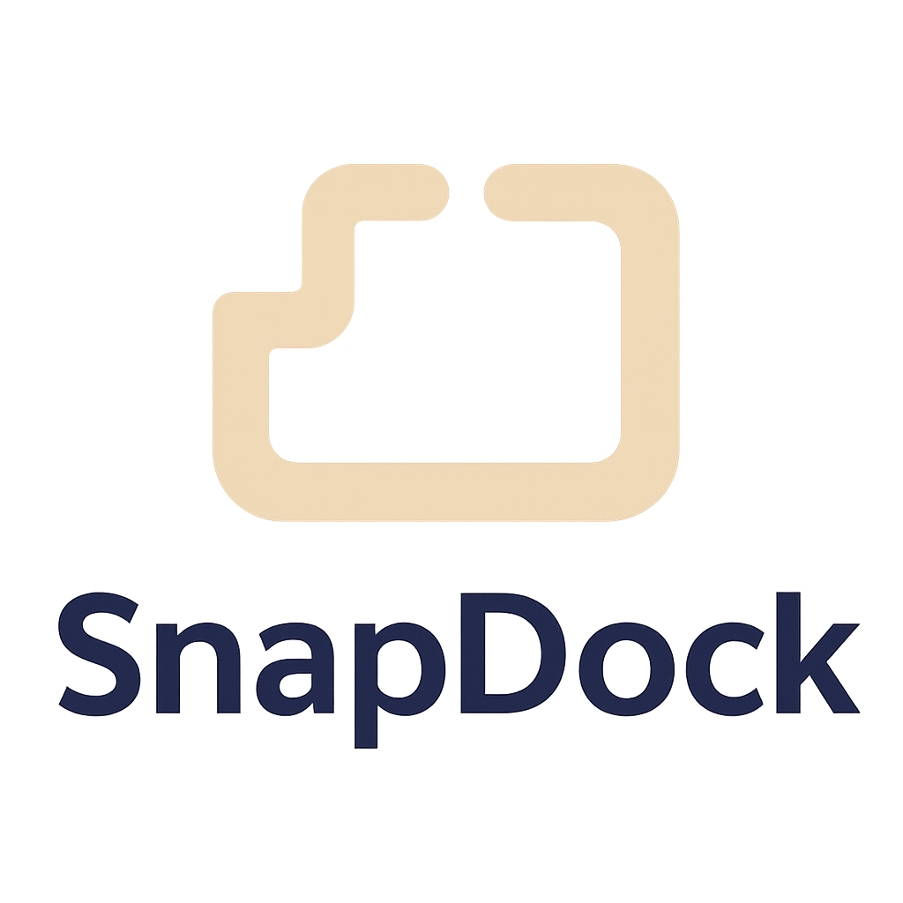

<h1 align="center">
  <br/>
</h1>

<p align="center">
   SnapDock — Lightweight Markdown Editor & Viewer <br/>
  Built by <strong>Zachary Ford</strong>
</p>

---

## About this project

Hi! I’m a self‑taught developer, and SnapDock is one of the first real apps I’ve built.
It started as a personal experiment to learn Electron, but it grew into something I think is genuinely useful: a fast, lightweight alternative to heavier markdown tools like Obsidian or VS Code.

I know it’s not perfect — there are bugs and missing features — but I’m sharing it here because:
- **Build in public:** I want to keep learning by shipping real changes.
- **Collaborate:** I believe community input makes projects stronger.
- **Career growth:** I’m actively looking for work, and showing progress helps me grow my craft.

If you think SnapDock is cool, please help me make it better!

---

## Branch: rust-filetree
This branch introduces a Rust crate under `src/filetree/` to begin transitioning file tree logic
from JavaScript to Rust. The goal is to phase out `scripts.js` into a lightweight handler layer.

---

## Project structure

```
snapdock/
├── assets/              # Icons, images
├── dist/                # Build output (ignored in git)
├── markdown-it-master/  # Markdown parser (customized, slated for removal)
├── node_modules/        # Dependencies (ignored in git)
├── src/                 # Source code
│   ├── filetree/        # Rust crate for file tree logic
│   │   ├── Cargo.toml
│   │   └── src/
│   │       └── lib.rs
│   ├── scripts.js       # Core logic (being phased into Rust handler)
│   └── styles.css       # Styling
├── .gitignore           # Git ignore rules
├── index.html           # Main app file
├── LICENSE              # License file
├── main.js              # Electron window bootstrapper
├── package.json         # Project metadata
├── package-lock.json    # Dependency lockfile (ignored in git)
├── README.md            # Project documentation
└── version.json         # Version tracking
```

---

## SnapDock v1R.3.0 (Rust Integration Branch)

This branch introduces Rust-powered filesystem integration:
- Directory selection via Electron dialog
- Rust-backed listing of folders and files
- Collapsible tree view with file open support

The `R` in the version tag indicates the Rust branch. Once stable, this will merge into the mainline version and the `R` will be dropped.

## Key features (Beta)

- **Live preview:** Real‑time markdown rendering
- **File navigation:** Open single files or folders
- **Themes:** Toggle and customize light/dark

---

## Build process

Run SnapDock with these scripts (via `package.json`):

```json
{
  "scripts": {
    "start": "electron .",
    "dist": "electron-builder --dir",
    "pack": "electron-builder --win --linux",
    "build": "electron-builder"
  }
}
```

**Build configuration**
- **Electron:** 28.0.0
- **Platforms:** Windows (NSIS installer), Linux (AppImage)
- **Icon:** `assets/icon.ico`

---

## Known issues (Beta)

I’d love help fixing these!
1. **PDF export:** Prints blank page.
2. **File tree:** Selecting items may override unsaved changes.
3. **Saving:** Per‑page only; no workspace‑level save.
4. **Preview gaps:** Markdown preview not fully feature‑complete.
5. **Update logic:** Placeholder; needs real integration.

---

## Screenshots


<h3 align="center">Screenshots</h3>

<div align="center">
    
    <br/>
    **Live preview:** Light theme
</div>

<br/>

<div align="center">
    
    <br/>
    **Editor view:** Dark theme
</div>

---

## Roadmap

- **Parser cleanup:** Remove `markdown-it-master` (customized edition) and replace with a maintainable approach.
  - **Option A:** Upstream `markdown-it` with clean renderer overrides and plugins.
  - **Option B:** Keep a vendored fork in `vendor/markdown-it` temporarily, with documented deltas.
- **Rust integration:** Introduce Rust for robustness and performance.
  - **Phase 1:** Implement reliable print‑to‑PDF in Rust (WASM/Neon) to replace the old HTML‑to‑PDF path.
  - **Phase 2:** Explore Rust‑based markdown parsing (e.g., pulldown‑cmark) as a drop‑in for preview.
- **Modularization:** Split `scripts.js` into focused modules.
  - **Preview:** Rendering + theme
  - **Editor:** Input, autosave
  - **Files:** File/folder operations
  - **Tabs:** Tab management
- **Stability:** Improve state management to protect unsaved changes.
- **Collaboration:** Add issue templates, labels, and contribution guidelines.

---

## Contributions welcome

This is open source, and I’d be thrilled if you contribute:
- **Fork & PR:** Bug fixes, features, refactors
- **Issues:** Report bugs or suggest improvements
- **Discord:** Join our community for feedback & collaboration

- [💬 Discord](https://discord.gg/4RGzagyt7C)

---

## License

MIT License — free to use, modify, and distribute. Please keep this notice.

---

## 🫂 Stay Connected

- [**Join me on Discord**](https://discord.gg/4RGzagyt7C)
- [**find this project on GitHub**](https://github.com/ZFordDev/SnapDock)
- [**Connect on Facebook**](https://www.facebook.com/zachary.ford.944654)

---

## ❤️ Support

SnapDock is free and open source. If it helps you, consider supporting the creator via ZetoLabs:
- [**Ko‑Fi**](https://ko-fi.com/zetolabs)

---