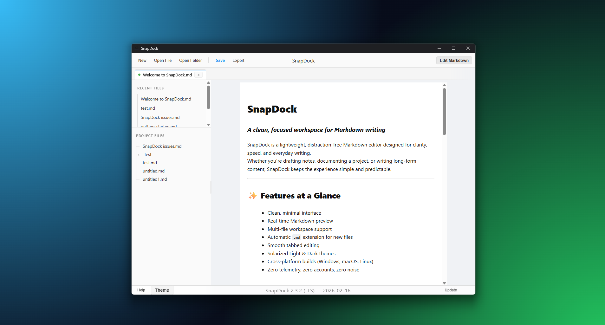
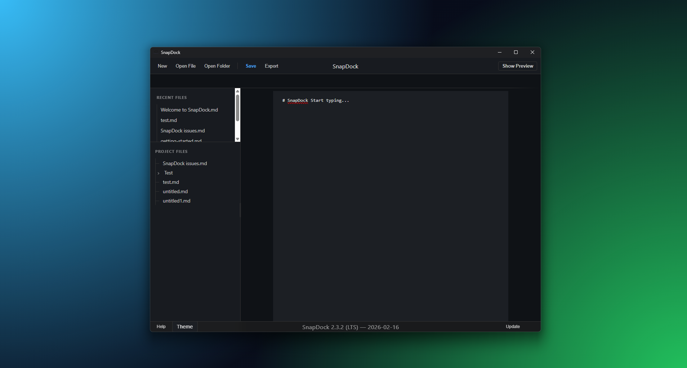
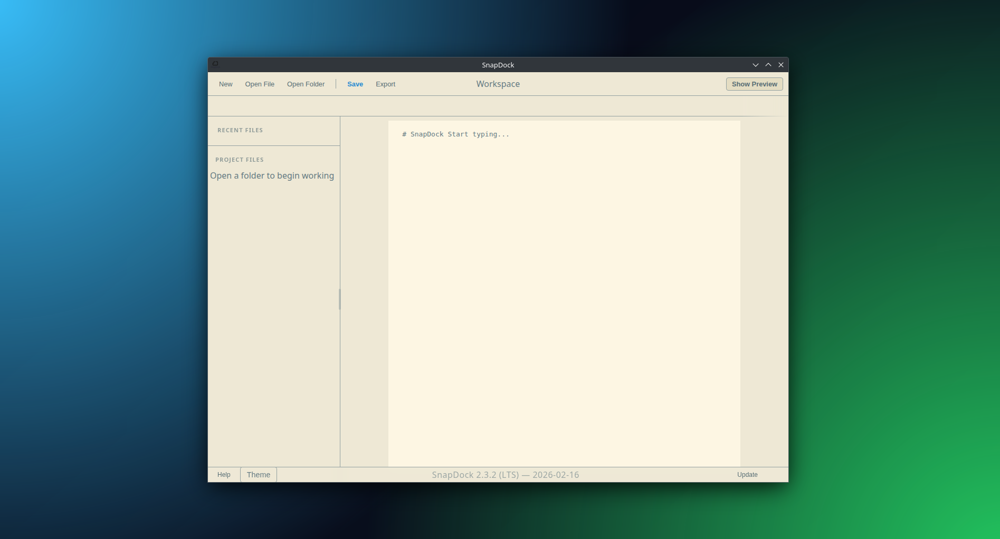
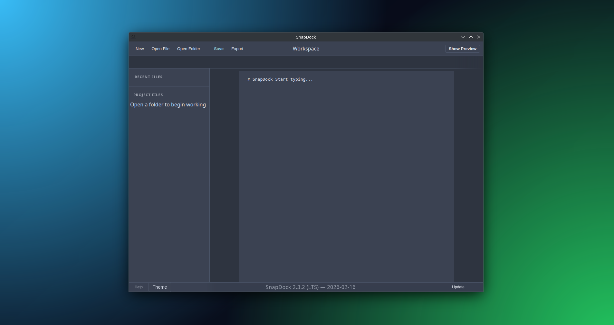

<div align="center">

# SnapDock

[](https://snapdock.app)
[](https://github.com/ZFordDev/SnapDock/issues)
[](https://docs.snapdock.app/docs/snapdock/2/)
[](https://zforddev.itch.io/snapdock)
[](https://ko-fi.com/zforddev)


---
</div>

## 📖 Overview

SnapDock is a lightweight Markdown editor built with Electron and powered by **markdown‑it**. It delivers a clean, modern writing experience with a layout inspired by professional IDEs—minus the complexity.

Designed for clarity and stability, SnapDock feels like a traditional writing app, making it the ideal home for your notes, technical docs, and daily thoughts.

---

## 🛡️ Long‑Term Support (LTS)

> [!IMPORTANT]
> **SnapDock is an LTS application.** The architecture is intentionally "feature-complete." Future updates focus strictly on security, performance, and bug fixes rather than experimental feature creep.

- **Predictable:** No breaking UI changes.
- **Reliable:** Focused on long-term file safety.
- **Lightweight:** Stays fast as your library grows.

---

## 🚀 Download & Install

| Platform | Download Link |
| :--- | :--- |
| **Windows** | [Setup (.exe)](https://github.com/ZFordDev/SnapDock/releases/latest/download/SnapDock-Setup.exe) |
| **Linux** | [Debian (.deb)](https://github.com/ZFordDev/SnapDock/releases/latest/download/SnapDock-Setup.deb) |
| **Universal** | [AppImage](https://github.com/ZFordDev/SnapDock/releases/latest/download/SnapDock-Setup.AppImage) |
| **Source** | [All Releases](https://github.com/ZFordDev/SnapDock/releases) |

> **Note:** SnapDock includes an auto‑update feature. WSL is supported but cannot run the in‑app updater.

---

## ✨ Features

- 🎨 **Five Themes:** Light, Dark, Solarized, Forest, and Arctic.
- 📂 **Workspace-Aware:** Integrated file-tree dock and recent files history.
- 📑 **Tabbed Editing:** Clean management of multiple open documents.
- ⚡ **Performance:** Uses ~180MB RAM and <1% CPU.
- 📄 **PDF Export:** Clean, professional document rendering.
- 🛠️ **Modern MD:** Full support for tables, callouts, and footnotes.

---

## 📸 Screenshots

<div align="center">

| Light (Windows) | Dark (Windows) |
| :---: | :---: |
|  |  |
| **Solarized (Linux)** | **Arctic (Linux)** |
|  |  |

</div>

---

## 🛠️ Build From Source

```bash
# Clone and install dependencies
npm install

# Build for your current OS
npm run build

```

---

## 🤝 Contributing

SnapDock is community-driven! Whether you're fixing a bug or suggesting a theme, your input is welcome.

* **New to OS?** Look for `good first issue` tags.
* **Hall of Fame:** Special thanks to **@misbahmansoori** for their significant contributions to the V2 stack.

### Community Contributors

* **@misbahmansoori**
* **@Abmarne**
* **@Karel-cz** 

---

## Project Status & Updates

SnapDock and the wider ZFordDev ecosystem are still actively maintained.  
Development has slowed temporarily while I balance full‑time work and parenting, but the mission continues.

For the latest detailed update, visit **ZFord.dev**:  
🔗 https://zford.dev

For archived announcements and historical notes, see the **News** section:  
🔗 https://docs.zford.dev/docs/news/

---

## 🌟 SnapDock V3 (Coming Soon)

V3 is a parallel evolution focusing on a refreshed UI and wider distribution via the **Windows Store** and **Snap Store**.

*Note: V2 will remain maintained as the classic LTS version. You choose the experience that fits your workflow.*

---

<div align="center">

### [SnapDock's Website](https://snapdock.app) • [ZFordDev](https://zford.dev) • [Support on Ko-fi](https://ko-fi.com/zforddev)

Licensed under [MIT](https://www.google.com/search?q=LICENSE) © ZFordDev

</div>
