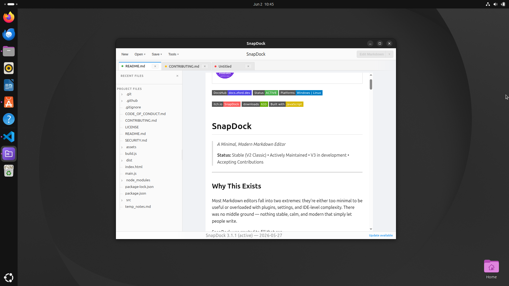
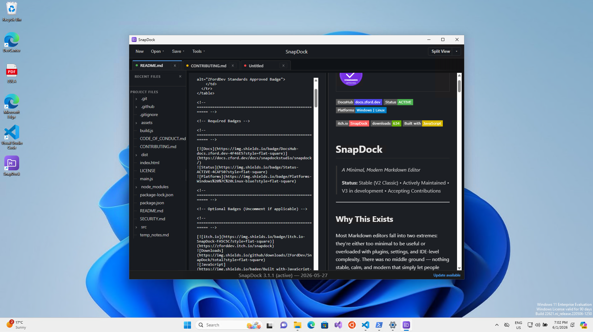

<!-- ========================================================= -->
<!-- Standards Approval Badge -->
<!-- ========================================================= -->
<table align="right">
  <tr>
    <td>
      
    </td>
  </tr>
</table>

<!-- ========================================================= -->

<!-- Required Badges -->

<!-- ========================================================= -->

[](https://docs.zford.dev/docs/snapdockstudio/snapdock/)


<!-- ========================================================= -->

<!-- Optional Badges (Uncomment if applicable) -->

<!-- ========================================================= -->

[](https://zforddev.itch.io/snapdock)


# SnapDock 

> *A Minimal, Modern Markdown Editor*
>
> **Status:**
> Stable (V2 Classic) • Actively Maintained • V3 in development • Accepting Contributions

---

## Why This Exists

Most Markdown editors fall into two extremes: they’re either too minimal to be useful or overloaded with plugins, settings, and IDE‑level complexity. There was no middle ground — nothing stable, calm, and modern that simply let people write.

SnapDock was created to fill that gap.  
It provides a predictable, distraction‑free Markdown workspace for writers, developers, and creators who want clarity, speed, and a local‑first environment that stays out of the way.


## Overview
SnapDock is a modern, distraction-free Markdown editor built for people who want to write without fighting their tools.

It focuses on clarity, stability, and local-first writing — offering a calm editing experience without plugin overload, IDE complexity, or unnecessary workflow friction.

SnapDock sits between minimalist note apps and heavily extensible writing platforms, providing a predictable and focused desktop writing experience that stays fast and approachable.

---

## Features

- Multi‑tab Markdown editing  
- Drag‑and‑drop tab reordering  
- Selectable preview modes  
- Workspace‑based file management  
- Recent file tracking  
- Local‑first document workflow  
- Lightweight, modern UI  
- Multiple built‑in themes  
- Cross‑platform desktop support  

---

## Requirements

SnapDock runs on any modern system that supports Electron‑based desktop apps. No additional runtimes or dependencies need to be installed.

**Operating System**
- Windows 10 or later  
- Linux (Ubuntu, Debian, Fedora, Arch, Mint, Pop!\_OS, etc.)  
- WSL is supported (in‑app updater disabled)  
- macOS support is not currently available  

**Hardware**
- CPU: 1 core minimum (2 cores recommended)  
- Memory: 512 MB minimum (1 GB recommended)  
- Disk Space: ~750 MB  

**Performance**
SnapDock typically uses around **180 MB RAM** and **under 1% CPU** during normal editing, making it suitable for low‑power laptops, VMs, and older hardware.

---

## Quick Start

Get SnapDock running from source:

```bash
git clone https://github.com/ZFordDev/SnapDock.git
cd SnapDock

# Install dependencies
npm install

# Build the app
npm run build
```

**Windows**
- `npm install | npm run build`  
- If npm is missing, install Node.js from [https://nodejs.org](https://nodejs.org)

**Linux**
- `npm install && npm run build`  
- If npm is missing: `sudo apt install npm`

**Dev mode:** Coming soon

---

## Installation

Most users should install SnapDock using the prebuilt packages available on the Releases page:

👉 [https://github.com/ZFordDev/SnapDock/releases](https://github.com/ZFordDev/SnapDock/releases)

**Windows**
- Download the `.exe` installer  
- Run it  
- SnapDock is ready to use

**Linux**
- Download the `.AppImage` or `.deb` package  

**AppImage**
```bash
chmod +x SnapDock-Setup.AppImage
./SnapDock-Setup.AppImage
```
> If your distro blocks AppImages, install FUSE or use the `.deb` package instead.

**.deb Package**
- Double‑click to install via your Software Center  
  **or**
```bash
sudo apt install ./SnapDock-Setup.deb
```

No additional runtimes or dependencies are required.

---

## Project Structure
*SnapDock uses a clean, modular layout. Only the high‑level structure is shown*
```
SnapDock/
├── assets/                 # App icons, images, and user guide resources
│
├── src/
│   ├── modules/            # Core application logic
│   │   ├── file/           # File operations, autosave, workspace, tabs
│   │   ├── markdown.js     # Markdown rendering pipeline
│   │   ├── pdf/            # PDF export templates and logic
│   │   ├── system/         # Dirty state + update system
│   │   ├── ui/             # UI logic (menus, themes, editor state)
│   │   └── updater/        # In-app update system
│   │
│   ├── styles/             # CSS structure (base, components, themes)
│   ├── preload.js          # Electron preload bridge
│   ├── scripts.js          # Renderer scripts
│   └── styles.css          # Entry stylesheet
│
├── index.html              # Main application window
├── main.js                 # Electron main process
├── build.js                # Build pipeline
│
├── README.md
├── LICENSE
├── CODE_OF_CONDUCT.md
├── CONTRIBUTING.md
├── SECURITY.md
└── temp_notes.md           # Internal notes (not part of the app)
```

---

## Roadmap

Planned improvements and upcoming development goals for SnapDock.  
This list reflects active GitHub issues and near‑term release targets.

### **In Progress / High Priority**
- [ ] **Ecosystem Standards Migration**  
  _Documentation improvements and alignment with ZFordDev ecosystem standards_  
  (#109)

- [ ] **Integrate New Updater Logic**  
  _Modernized update pipeline for V3 and future releases_  
  (#104)

### **UI / UX Improvements**
- [ ] **Replace Electron Frame With Custom SnapDock Frame**  
  _Cleaner, native-feeling window chrome_  
  (#95)

- [ ] **Add Tab Overflow Scrolling / Horizontal Scroll**  
  _Improves usability for large workspaces_  
  (#87)

### **Platform Releases**
- [ ] **Windows Store Release**  
  _Submission + certification for Microsoft Store_

- [ ] **Snap Store Release**  
  _Snapcraft packaging + publishing_

### **Upcoming (V3 Cycle)**
- [ ] New developer mode (`npm run dev`)
- [ ] Theme engine improvements + custom theme support
- [ ] Enhanced PDF export pipeline
- [ ] V3 UI/UX redesign
- [ ] Import custom `.sdwp` files as virtual workspaces

---

## Screenshots

<p align="center">
  
  
</p>

---
# break #
Old section cont
---


## 🛠 Current State

| Version | Status | Focus |
|---|---|---|
| **SnapDock 3.x** | Active Development | Modern rewrite, new UI, improved architecture |
| **SnapDock 2.x (Classic)** | Archived | Original SnapDock experience |
| **SnapDock Online** | Experimental | Lightweight browser-based preview |

---

## 🌐 Ecosystem

SnapDock also acts as the foundation for related desktop tools and experiments within the broader SnapDock ecosystem.

These projects focus on:
- local-first workflows
- lightweight desktop utilities
- writing and organization tools
- minimal friction and clean UI design

Related projects include:
- SnapBoard
- future workspace tools
- experimental desktop integrations

---

## 🚀 Installation

### SnapDock V3 Preview Builds
https://snapdock.app/snapdock-v3/

### SnapDock Classic Downloads
https://snapdock.app/downloads

---

## 📖 Documentation & Resources

### Local Documentation
- `assets/resources/docs/user_guide.md`
- `assets/resources/docs/versioning-strategy.md`
- `SECURITY.md`
- `ROADMAP.md`

### External Links
- Official Website: https://snapdock.app/
- Documentation Hub: https://docs.snapdock.app/docs/snapdock/

---

## 👥 Contributing

SnapDock welcomes community contributions of all sizes.

Good areas to contribute:
- UI/UX polish
- editor workflow improvements
- theme refinement
- markdown rendering
- accessibility
- Linux packaging/testing
- performance improvements

Issues tagged:
- `good first issue`
- `UI/UX`
- `help wanted`

…are especially beginner-friendly.

---

## ❤️ Contributors

SnapDock continues to evolve thanks to the time, care, and ideas shared by the community.

### Special Thanks

**@TechSwimmer**  
- added Save All support for multi‑tab workflows  
- improved close‑flow behavior with Save All confirmation handling  

**@Sanketmandwal**  
- implemented Split View with a fully functional two‑pane editor/preview layout  
- added resizable divider with clean UX and constraints  

**@18850196928-max**  
- added drag‑and‑drop tab reordering  
- added preview‑mode dropdown improvements  
- helped kickstart several core V3 workflow improvements  

**@wali-WallE**  
- added recent‑file clear controls with persistence improvements  

**@misbahmansoori**  
- improved workspace refresh behavior  
- improved Lite Mode code block rendering  
- added empty‑state file‑tree improvements  
- contributed theme and UI refinements  

**@Karel-cz**  
- added close‑button improvements for the Help popup  

**@Abmarne**  
- improved Solarized theme readability and contrast  

Thank you to everyone helping shape SnapDock.

---

## ❤️ Support the Project

If SnapDock helps you stay focused, consider supporting the project:

- ⭐ Star the repository
- ☕ Support on Ko-fi: https://ko-fi.com/zforddev

---

## 📄 License

See `LICENSE` for details.