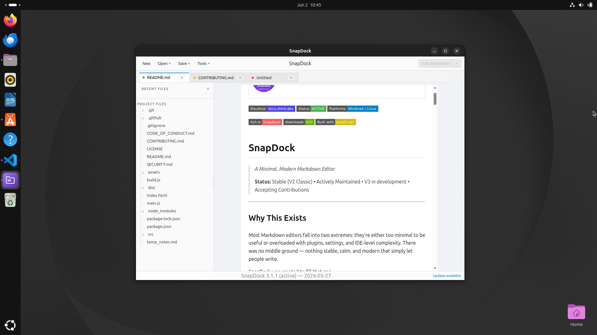
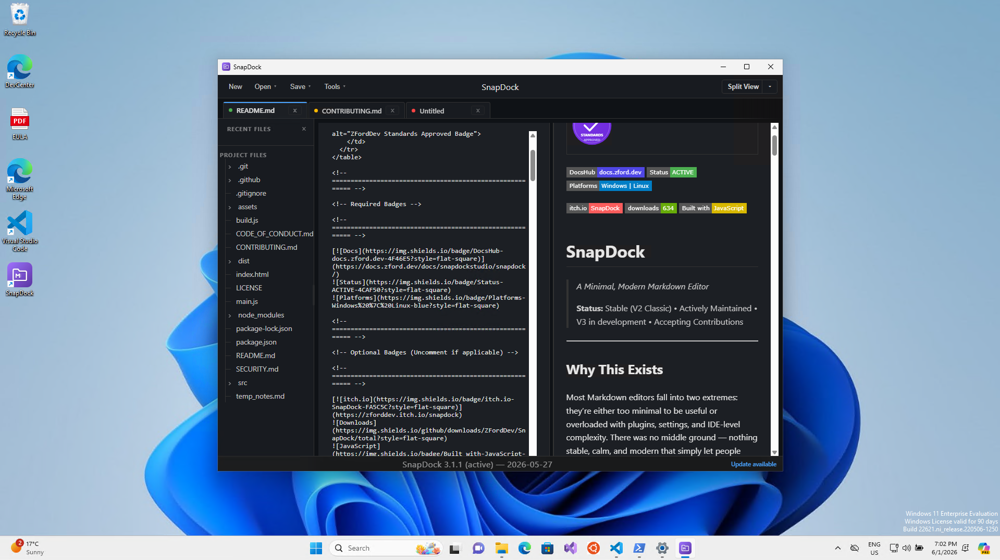

<div align="center">

# SnapDock

### A calm, modern Markdown editor for Windows and Linux

[Website](https://snapdock.app) · [Documentation](https://docs.snapdock.app) · [Downloads](https://snapdock.app/downloads) · [Report a bug](https://github.com/ZFordDev/SnapDock/issues/new/choose)

[](https://github.com/ZFordDev/SnapDock)
[](#installation)
[](https://github.com/ZFordDev/SnapDock/releases)
[](LICENSE)

</div>

SnapDock gives you a focused place to write, organise, and preview Markdown without turning your editor into an IDE. It is local-first, offline-friendly, and designed to stay out of your way.

<p align="center">
  
  
</p>

## Features

- **Workspace-based file management** with a file tree and workspace-scoped recent files
- **Multi-tab editing** with drag-and-drop tab reordering and unsaved-change protection
- **Flexible previews** with full-page and resizable split views
- **Rich Markdown rendering** including syntax highlighting, footnotes, task lists, emoji, anchors, marks, subscript, and superscript
- **Find in document** with keyboard navigation between matches
- **Writing metrics** for words and characters
- **PDF export** directly from the rendered preview
- **Built-in spellcheck** with correction suggestions from the native context menu
- **Five included themes**: Light, Dark, Solarized, Arctic Dark, and Forest
- **Local-first workflow** that keeps your Markdown files on your computer

## Installation

Choose your preferred store for straightforward installation and updates.

### Microsoft Store

[](https://apps.microsoft.com/detail/9P54JC7GWK1N)

### Snap Store

[](https://snapcraft.io/markdown-workspace)

```bash
sudo snap install markdown-workspace
```

### GitHub Releases

Installers and portable builds are also available from [GitHub Releases](https://github.com/ZFordDev/SnapDock/releases).

> On Linux, AppImage builds may require FUSE. On Ubuntu and Debian, install it with `sudo apt install libfuse2`. Snap and `.deb` installations do not require this AppImage-specific step.

## System requirements

- Windows 10 or later, or a modern Linux distribution
- 2 GHz processor
- 2 GB RAM
- 2 GB available disk space

_macOS is not currently supported._

## Build from source

You will need current Node.js and Rust toolchains, plus the platform prerequisites listed by Tauri.

```bash
git clone https://github.com/ZFordDev/SnapDock.git
cd SnapDock
npm install
npm start

# Create native installers
npm run tauri:build
```

## Project status and roadmap

SnapDock is stable, actively maintained, and open to contributions. Development priorities evolve with user feedback, so the live GitHub trackers are the source of truth:

- [Open issues and planned improvements](https://github.com/ZFordDev/SnapDock/issues)
- [Latest releases and release notes](https://github.com/ZFordDev/SnapDock/releases)
- [Contributing guide](CONTRIBUTING.md)

## Known limitations

- Live preview is not yet available; standard and split previews update while you work.
- Tauri's system webview can behave differently across Linux display servers and desktop environments. Please [report reproducible issues](https://github.com/ZFordDev/SnapDock/issues/new/choose) with your distribution, desktop environment, and display server.

## Support and contributing

Bug reports, feature ideas, documentation improvements, and code contributions are welcome. Read [CONTRIBUTING.md](CONTRIBUTING.md) before submitting a change, and use the [issue tracker](https://github.com/ZFordDev/SnapDock/issues) for bugs and suggestions.

Security vulnerabilities should be reported using the process in [SECURITY.md](SECURITY.md), not through a public issue.

If SnapDock is useful to you, starring the repository or sharing the project also helps.

## License

SnapDock is free and open-source software released under the [MIT License](LICENSE).

## About

SnapDock is part of the [SnapDock ecosystem](https://snapdock.app), a collection of focused tools for writing, planning, and creating. It is built and maintained by [ZFordDev](https://github.com/ZFordDev).
